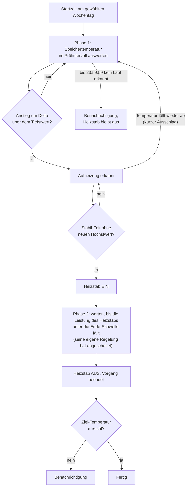

# Warmwasser Legionellenschaltung

Ein Home-Assistant-Blueprint für die **wöchentliche Legionellenschaltung** eines Warmwasserspeichers mit
Wärmepumpe und elektrischem Heizstab: Der Heizstab hebt die von der Wärmepumpe erzeugte Temperatur
nachträglich an, aber erst, **nachdem die Wärmepumpe ihren Warmwasserlauf abgeschlossen hat**. So wird
Strom gespart, weil der Heizstab nur den letzten Teil übernimmt.

[](https://my.home-assistant.io/redirect/blueprint_import/?blueprint_url=https%3A%2F%2Fgithub.com%2Fjubie25%2Fblueprints%2Fblob%2Fmain%2Fautomation%2FLegionellensteuerung%2Flegionella_heater_control.yaml)

**Aktuelle Version:** 1.7.0 · **Benötigt:** Home Assistant 2025.4 oder neuer · [Änderungshistorie](CHANGELOG.md)

---

## Das Problem, das dieser Blueprint löst

Wärmepumpen heizen oft Warmwasser **und** Raumheizung. Die Leistungsaufnahme der Wärmepumpe verrät
dann nicht, welcher der beiden Kreise gerade bedient wird. Ein einfaches "Heizstab an, sobald die
Wärmepumpe aus ist" funktioniert deshalb in der Heizperiode nicht zuverlässig.

Dieser Blueprint erkennt den Warmwasserlauf stattdessen **am Verlauf der Speichertemperatur**:

- Steigt die Temperatur um ein einstellbares **Delta** (Standard 0,8 °C) über den zuletzt gesehenen
  Tiefstwert, läuft eine Warmwasseraufheizung.
- Erreicht die Temperatur danach für eine einstellbare **Stabil-Zeit** keinen neuen Höchstwert mehr,
  ist der Wärmepumpenlauf abgeschlossen.
- Erst dann übernimmt der Heizstab.

## Ablauf



1. **Start:** Zur Startzeit am gewählten Wochentag beginnt Phase 1. Der Zeitpunkt wird im
   Prozess-Speicher (siehe unten) vermerkt.
2. **Phase 1, Wärmepumpenlauf abwarten:** Die Speichertemperatur wird im Prüfintervall ausgewertet,
   längstens bis 23:59:59 des Tages. Kommt bis dahin kein abgeschlossener Lauf zustande, bleibt der
   Heizstab aus, und du wirst benachrichtigt.
3. **Heizstab ein:** Danach schaltet der Blueprint den Heizstab ein und gibt ihm bis zu 5 Minuten, um
   Leistung aufzunehmen.
4. **Phase 2, Heizstab regelt selbst ab:** Der Heizstab heizt, bis seine **eigene Regelung** bei der
   Zieltemperatur abschaltet. Das erkennt der Blueprint daran, dass die gemessene Leistung für die
   Ende-Zeit unter die Ende-Schwelle fällt. Nach der **maximalen Heizdauer** wird er in jedem Fall
   ausgeschaltet.
5. **Abschluss:** Der Heizstab wird ausgeschaltet, der Prozess-Speicher zurückgesetzt, und es wird
   geprüft, ob die Ziel-Temperatur erreicht wurde.

## Voraussetzungen

| Was | Anforderung |
|---|---|
| Home Assistant | Version **2025.4 oder neuer** (der Blueprint nutzt das geänderte Variablen-Scoping in Schleifen) |
| Temperatursensor | Sensor mit Geräteklasse `temperature`, der die Temperatur im Warmwasserspeicher abbildet |
| Heizstab | Schalter (`switch`) mit **eigener Regelung/Thermostat**, der bei Zieltemperatur selbst abschaltet |
| Leistungsmessung | Sensor mit Geräteklasse `power` für den Heizstab, z. B. ein Schaltaktor mit Leistungsmessung |
| Helfer | Ein `input_datetime` mit aktivierten Optionen **Datum** und **Uhrzeit** |

## Installation

### 1. Blueprint importieren

Über den Button oben oder manuell: *Einstellungen → Automatisierungen & Szenen → Blueprints →
Blueprint importieren* und diese URL einfügen:

```
https://github.com/jubie25/blueprints/blob/main/automation/Legionellensteuerung/legionella_heater_control.yaml
```

Alternativ die Datei `legionella_heater_control.yaml` nach `config/blueprints/automation/<ordner>/`
kopieren und die Automatisierungen neu laden.

### 2. Prozess-Speicher anlegen

*Einstellungen → Geräte & Dienste → Helfer → Helfer hinzufügen → Datum und/oder Uhrzeit.*
Beide Optionen, **Datum** und **Uhrzeit**, aktivieren.

Der Helfer dient zugleich als Statusspeicher und als Zeitstempel. Steht darin der Startzeitpunkt von
heute, gilt der Vorgang als offen. Der feste Wert `1970-01-01 00:00:00` bedeutet "geschlossen".

### 3. Automatisierung aus dem Blueprint erstellen

*Einstellungen → Automatisierungen & Szenen → Automatisierung erstellen → Blueprint verwenden* und die
Felder ausfüllen (siehe nächster Abschnitt).

## Einstellungen

### Entitäten

| Feld | Beschreibung |
|---|---|
| Temperatursensor Warmwasserspeicher | Sensor für die Speichertemperatur |
| Schalter Heizstab | Schalter, der den Heizstab freigibt |
| Leistungssensor Heizstab | Leistungsmessung des Heizstabs |
| Prozess-Speicher (input_datetime) | Der oben angelegte Helfer |

### Zeitplan

| Feld | Standard | Beschreibung |
|---|---|---|
| Startzeit | 14:00:00 | Ab dieser Uhrzeit wird auf den Wärmepumpen-Warmwasserlauf gewartet |
| Wochentag(e) | Sonntag | Tage, an denen die Legionellenschaltung läuft |

### Schwellwerte und Zeiten

| Feld | Standard | Beschreibung |
|---|---|---|
| Temperatur-Delta "Aufheizung erkannt" | 0,8 °C | Anstieg über den Tiefstwert, ab dem eine Aufheizung angenommen wird. Grenzt gegen warmen Rücklauf nach einer Zapfung ab |
| Prüfintervall Speichertemperatur | 2 min | Abstand, in dem die Temperatur ausgewertet wird |
| Stabil-Zeit nach letztem Höchstwert | 10 min | So lange darf kein neuer Höchstwert mehr erreicht werden, damit der Wärmepumpenlauf als abgeschlossen gilt |
| Leistungsschwelle Heizstab "heizt" | 100 W | Darüber gilt der Heizstab als aktiv |
| Leistungsschwelle Heizstab "abgeschaltet" | 10 W | Darunter hat die Regelung des Heizstabs abgeschaltet |
| Ende-Zeit Heizstab | 2 min | So lange muss die Leistung unter der Ende-Schwelle bleiben |
| Maximale Heizdauer | 4 h | Sicherheits-Timeout. Danach wird der Heizstab ausgeschaltet |
| Ziel-Temperatur | 60 °C | Liegt der Speicher am Ende darunter, wirst du benachrichtigt |

Die **Stabil-Zeit** ist der wichtigste Stellhebel. Sie sollte deutlich länger sein als der Abstand
zwischen zwei Temperaturschritten deines Sensors am Ende des Wärmepumpenlaufs, sonst startet der
Heizstab zu früh.

### Benachrichtigung

Das Feld "Benachrichtigungs-Aktion" nimmt eine beliebige Aktion auf. Darin stehen die Variablen
`titel` und `nachricht` zur Verfügung, zum Beispiel:

```yaml
action: notify.mobile_app_mein_handy
data:
  title: "{{ titel }}"
  message: "{{ nachricht }}"
```

Bleibt das Feld leer, wird nicht benachrichtigt.

## Meldungen

Benachrichtigt wird, wenn

- kein abgeschlossener Wärmepumpen-Warmwasserlauf bis Tagesende erkannt wurde (der Heizstab bleibt aus),
- der Heizstab nach der maximalen Heizdauer nicht von selbst abgeschaltet hat,
- die Ziel-Temperatur am Ende nicht erreicht wurde,
- die Stabil-Zeit 0 oder nicht lesbar ist (aus Sicherheitsgründen startet der Heizstab dann nicht),
- ein verwaister Vorgang gefunden und zurückgesetzt wurde (der Heizstab wird dabei ausgeschaltet).

Jede Meldung endet mit der Blueprint-Version, z. B. `(Blueprint v1.7.0)`.

Zusätzlich schreibt der Blueprint wichtige Schritte ins **Logbuch** (Quelle "Legionellenschaltung"):
Start von Phase 1 mit den verwendeten Werten, Erkennung der Aufheizung, Zurücksetzen der Erkennung
nach einem kurzen Ausschlag und die Entscheidung vor dem Einschalten des Heizstabs.

## Neustart, Neuladen und Abbrüche

Ein Neustart von Home Assistant und das Neuladen der Automationen (Speichern in der UI, "YAML-Konfiguration
neu laden") brechen einen laufenden Lauf ab, denn der Lauf existiert nur im Arbeitsspeicher. Der Blueprint
reagiert auf beide Ereignisse und entscheidet anhand des Prozess-Speichers:

| Prozess-Speicher | Bedeutung | Reaktion |
|---|---|---|
| `1970-01-01 00:00:00` (oder unbekannt) | kein Vorgang offen | nichts, auch der Heizstab wird nicht angefasst |
| Startzeitpunkt von **heute** | Vorgang wurde abgebrochen | wird fortgesetzt: Ist der Heizstab aus, beginnt Phase 1 von vorn. Läuft er schon, geht es mit Phase 2 weiter |
| Startzeitpunkt von einem **früheren Tag** | verwaister Vorgang | Heizstab aus, Prozess-Speicher zurückgesetzt, Logbuch-Eintrag und Meldung |

Das Neuladen einer **anderen** Automation stört einen laufenden Vorgang nicht und erzeugt keine
Log-Warnungen.

**Einschränkung:** Beginnt Phase 1 nach einem Neustart von vorn, sind Tiefst- und Höchstwert verloren. Ist
der Wärmepumpenlauf zu diesem Zeitpunkt schon beendet, bleibt die Temperatur flach, und der Lauf wird
nicht mehr erkannt. Der Heizstab startet dann nicht, am Tagesende kommt die Meldung "kein abgeschlossener
Lauf erkannt", und die Woche entfällt. Betroffen ist nur das Fenster vom Beginn des Temperaturanstiegs bis
zum Heizstab-Start, bei typischen Werten etwa eine Viertelstunde. Plane Updates und Neustarts möglichst
nicht in diese Zeit.

## Empfohlene Absicherung

Ein abgebrochener Lauf kann sich nicht selbst aufräumen, denn Home Assistant kennt keinen
"bei Abbruch"-Hook. Der Blueprint holt das beim nächsten Neustart oder Neuladen nach. Für die Zeit dazwischen
empfiehlt sich eine Absicherung außerhalb von Home Assistant:

- **Auto-Off-Timer am Schaltaktor:** Viele Aktoren (z. B. Shelly) können einen Kanal nach einer festen
  Zeit selbst ausschalten. Stelle ihn auf mindestens "Maximale Heizdauer + 10 Minuten", bei den
  Standardwerten also etwa 4,5 Stunden. Er greift auch, wenn Home Assistant ausfällt. Er gilt für jede
  Nutzung dieses Kanals, nicht nur für die Legionellenschaltung.
- **Manuelles Zurücksetzen** (z. B. als Dashboard-Button). `automation.DEINE_AUTOMATION`,
  `switch.DEIN_HEIZSTAB` und den Prozess-Speicher anpassen:

```yaml
script:
  legionellenschaltung_reset:
    alias: Legionellenschaltung zurücksetzen
    sequence:
      - action: automation.turn_off
        target:
          entity_id: automation.DEINE_AUTOMATION
        data:
          stop_actions: true
      - action: switch.turn_off
        target:
          entity_id: switch.DEIN_HEIZSTAB
      - action: input_datetime.set_datetime
        target:
          entity_id: input_datetime.DEIN_PROZESS_SPEICHER
        data:
          datetime: "1970-01-01 00:00:00"
      - action: automation.turn_on
        target:
          entity_id: automation.DEINE_AUTOMATION
```

## Statusanzeige (optional)

Der Blueprint kann keine eigenen Sensoren anlegen. Wer den Zustand auf einem Dashboard sehen möchte,
kann einen Vorlagensensor in der `configuration.yaml` ergänzen. `input_datetime.legionellen_prozess`
durch die Entity-ID deines Prozess-Speichers ersetzen:

```yaml
template:
  - sensor:
      - name: "Legionellenschaltung Status"
        unique_id: legionellenschaltung_status
        state: >-
          
          {{ 'Geschlossen' if (v in ['unknown', 'unavailable'] or v == '1970-01-01 00:00:00')
             else 'Offen seit ' + as_datetime(v).strftime('%H:%M') }}
        icon: >-
          
          {{ 'mdi:check-circle-outline' if (v in ['unknown', 'unavailable'] or v == '1970-01-01 00:00:00')
             else 'mdi:progress-clock' }}
```

Danach *Einstellungen → System → ⋮ → YAML-Konfiguration neu laden → Vorlagenentitäten*.

## Grenzen und Hinweise

- **Sicherheit:** Der Blueprint ersetzt keine Sicherheitseinrichtungen. Der Heizstab sollte einen
  eigenen Thermostat und Sicherheitstemperaturbegrenzer haben. Die Abschaltung bei Zieltemperatur
  übernimmt die Regelung des Heizstabs. Der Blueprint schaltet nur nach Ablauf der maximalen
  Heizdauer ab.
- **Legionellenschutz:** Geprüft wird am Ende nur, ob die **Ziel-Temperatur erreicht** wurde. Eine
  Haltezeit bei dieser Temperatur wird nicht überwacht.
- **Temperaturbasierte Erkennung:** Sie funktioniert, wenn der Temperatursensor den Ladevorgang der
  Wärmepumpe sichtbar abbildet. Sitzt der Sensor so, dass der Anstieg kaum erkennbar ist, bleibt die
  Erkennung aus, und der Heizstab startet nicht (mit Benachrichtigung).
- **Ein Speicher pro Instanz:** Für mehrere Speicher je eine Automatisierung mit eigenem
  Prozess-Speicher anlegen.

## Fehlersuche

| Beobachtung | Hinweis |
|---|---|
| Heizstab startet zu früh | **Stabil-Zeit** erhöhen. Im Logbuch steht bei "Heizstab wird eingeschaltet", wie lange kein neuer Höchstwert kam |
| Heizstab startet nie, Meldung "kein abgeschlossener Lauf erkannt" | **Delta** verkleinern oder prüfen, ob der Sensor den Anstieg zeigt. Im Logbuch erscheint "Aufheizung erkannt", sobald der Anstieg gesehen wurde |
| Änderungen am Blueprint wirken nicht | *Einstellungen → System → ⋮ → YAML-Konfiguration neu laden → Automatisierungen*. "Neu importieren" geht nur bei per URL importierten Blueprints |
| Heizstab blieb nach einem Abbruch an | Beim nächsten Neustart oder Neuladen wird er ausgeschaltet (mit Meldung). Sofort: das Reset-Skript oben. Dauerhaft: Auto-Off-Timer am Aktor |
| Genaue Werte nachvollziehen | *Automatisierung → Traces → Lauf wählen → Schritt "Wenn: ... is_state(heizstab, 'off')"* → Tab "Geänderte Variablen": `ref_min`, `max_seit_start`, `heizung_erkannt`, `stabil_seit`, `ww_stabil_zeit_sek` |

## Weitere Informationen

- [Änderungshistorie](CHANGELOG.md)
- [Blueprint-Datei](legionella_heater_control.yaml)
